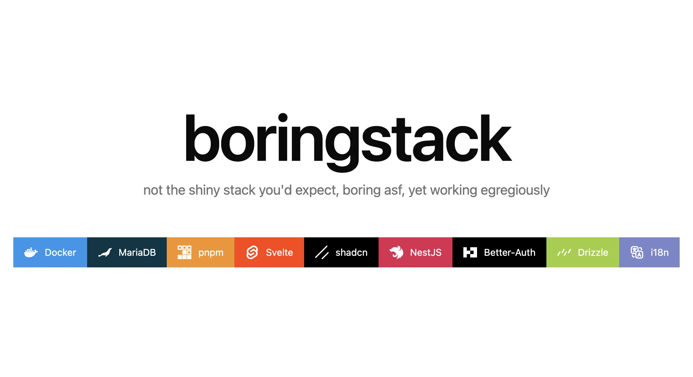

Boring, type-safe full-stack monorepo: NestJS + Drizzle (MariaDB) + Better Auth on the back, SvelteKit on the front, with an end-to-end typed SDK generated by [Nestia](https://nestia.io).

## Layout

| Path            | What                              |
| --------------- | --------------------------------- |
| `packages/api`  | NestJS application code           |
| `packages/db`   | Drizzle schema and migrations     |
| `packages/i18n` | Shared message/error catalogs     |
| `packages/sdk`  | Nestia-generated typed API client |
| `apps/api`      | API runner (Swagger UI at `/api`) |
| `apps/web`      | SvelteKit app (CSR)               |

## Development

```bash
vp install
cp .env.example .env
docker compose up mariadb
vp run dev
```

- API: http://localhost:3000
- Web: http://localhost:5173

`vp run dev:api` / `vp run dev:web` run either side alone.

## SDK / OpenAPI

After changing API routes, regenerate the SDK and OpenAPI spec:

```bash
vp run openapi:export
```

The web app imports the client from `@boringstack/sdk`. Swagger UI is served at `http://localhost:3000/api` from `apps/api/openapi/openapi.json`.

## Database

```bash
vp run db:generate   # generate migrations from schema
vp run db:migrate    # apply migrations
vp run db:push       # push schema directly (dev)
```

## Auth

Better Auth is mounted at `/api/auth` (`GET /api/auth/ok` for a health check). Configure `BETTER_AUTH_SECRET`, `BETTER_AUTH_URL`, and `BETTER_AUTH_TRUSTED_ORIGINS` in `.env`.

## Docker

```bash
docker compose up --build
```

API on `:3000`, web on `:3001`, MariaDB on `:3306` (overridable via `PORT`, `WEB_PORT`, `MARIADB_PORT`).
